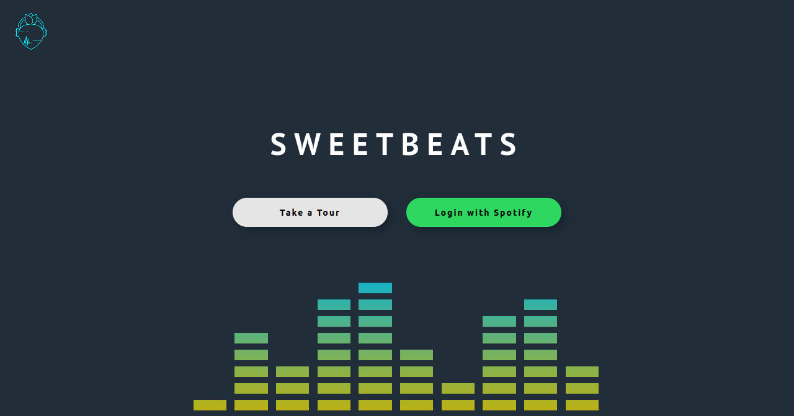

# Sweet Beats Server
**[sweetbeats-backend](https://sweet-beats.herokuapp.com/)** is the server side of a playlist creator that uses the [Spotify Web API](https://developer.spotify.com/documentation/web-api/quick-start/) and [OAuth 2.0 API](https://oauth.net/2/). The application allows the user to creator playlists based on bpm, danceability, energy, instrumentalness, and valence (musical positiveness). Users can enjoy a 30 second preview of songs in each playlist and save them to the user's Spotify account for later enjoyment. This application was created as part of [Chingu](https://chingu.io/) Voyage 19 by team Geckos 04.


<br><br><br>

## Prerequisite

* Clone the repository using `git clone`.

* Create a `.env` file within the root directory and include the below entries:

    Obtained from the [Spotify Dashboard](https://developer.spotify.com/dashboard/).
        ```
        SPOTIFY_CLIENT_ID=
        SPOTIFY_CLIENT_SECRET=
        ```
    ```
    FRONTEND_URI='http://localhost:3000'

    PASSPORT_URI='http://localhost:8888'
    ```

    Obtained from the [MongoDB Connect to Cluster](https://account.mongodb.com/account/login?nds=true).
        ```
        MONGO_URI=
        ```

    Random character for key generation and age of cookie.
        ```
        COOKIE_KEY=
        COOKIE_AGE=
        ```

## Available Scripts

In the root directory, you can run:

### `yarn install`

Install all dependencies necessary for the project.

### `yarn start`
Runs the server in the development mode on `http://locallhost:8888`.


### `yarn test`

Launches the test runner in the interactive watch mode.<br />
See the section about [running tests](https://facebook.github.io/create-react-app/docs/running-tests) for more information.

### `yarn build`

Builds the app for production to the `build` folder.<br />
It correctly bundles React in production mode and optimizes the build for the best performance.

The build is minified and the filenames include the hashes.<br />
Your app is ready to be deployed!

See the section about [deployment](https://facebook.github.io/create-react-app/docs/deployment) for more information.

## Dependencies

* [Body-Parser](https://www.npmjs.com/package/body-parser)
* [Cookie-Session](https://www.npmjs.com/package/cookie-session)
* [Cors](https://www.npmjs.com/package/cors)
* [Dotenv](https://www.npmjs.com/package/dotenv)
* [Express](https://www.npmjs.com/package/express)
* [Mongoose](https://www.npmjs.com/package/mongoose)
* [Passport](https://www.npmjs.com/package/passport)
* [Passport-Spotify](https://www.npmjs.com/package/passport-spotify)

### License
[GNU General Public License v3.0](https://www.gnu.org/licenses/gpl-3.0.en.html).